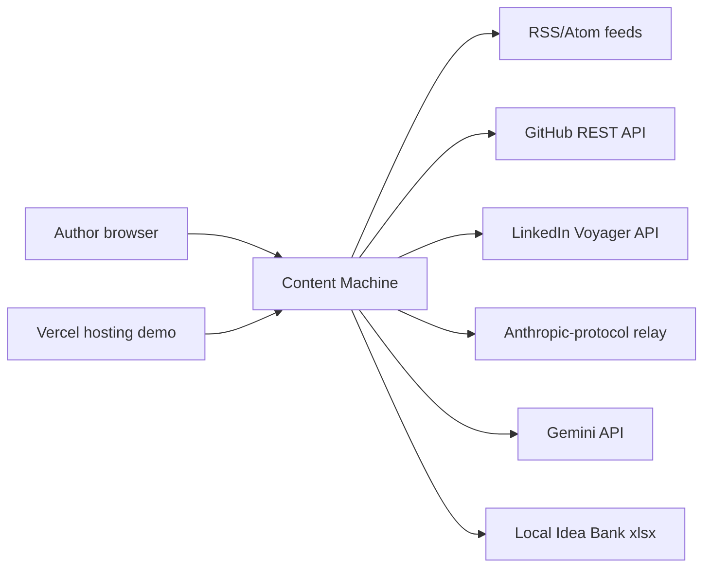
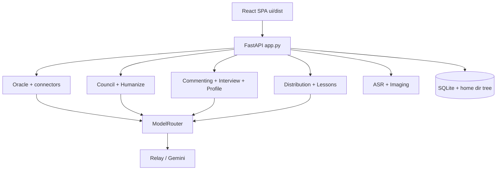
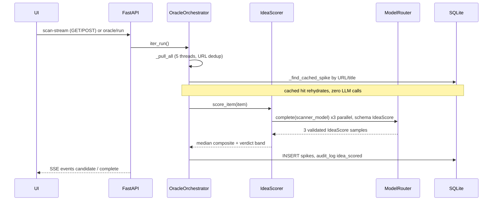
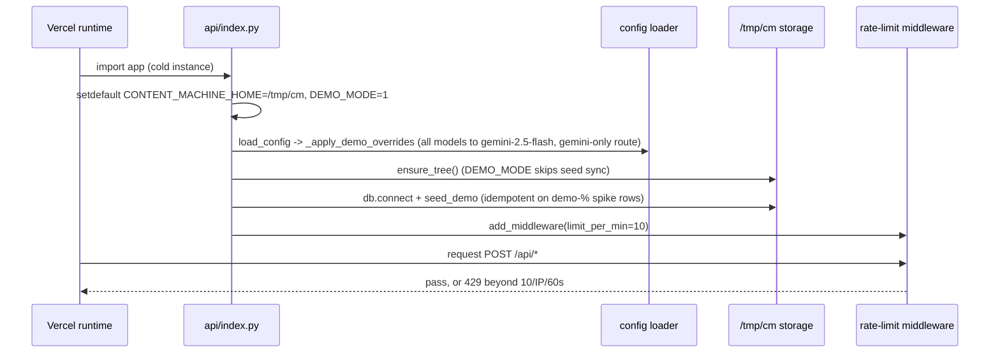
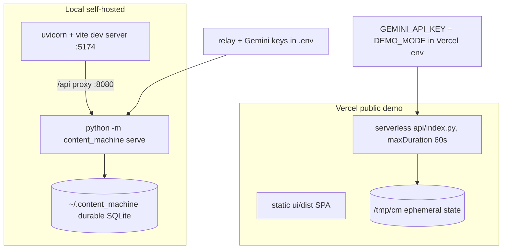

# Architecture

This document describes the architecture of Content Machine as implemented in this
repository. Every claim is traceable to a repo file; where a claim could not be
verified against code, it is stated as such. Numbers come from code and
`config.json`, not from the README.

- Backend: Python 3.11 (CI pin, `.github/workflows/ci.yml`) / 3.12 (`.python-version`), FastAPI, `content_machine/` package.
- Frontend: React + Vite + Tailwind SPA in `ui/`.
- State: single-file SQLite database plus a directory tree under `CONTENT_MACHINE_HOME` (default `~/.content_machine`, [storage/paths.py](content_machine/storage/paths.py)).
- Public demo: Vercel serverless Python function ([api/index.py](api/index.py)) + static `ui/dist` ([vercel.json](vercel.json)).

## 1. Architecture Overview

Content Machine is a local-first modular monolith with a REST API and a single-page
UI. One FastAPI process hosts the API, the subsystem logic (Oracle, Council,
Humanize, Commenting, Distribution, Lessons, Profile, Interview, ASR, Imaging), and —
when a UI build exists — the static SPA bundle itself
([api/app.py](content_machine/api/app.py), `_UI_DIST` mount and SPA fallback route).
There is no separate worker tier, no service mesh, and no message broker; subsystems
call each other in-process through the shared [ModelRouter](content_machine/router/base.py)
and one SQLite connection per operation.

Quality goals established by the implementation (each with evidence):

- **Offline-verifiable development.** CI runs `python -m pytest tests -q` and `npm test`
  with no credentials or network services configured (`.github/workflows/ci.yml`);
  [docs/testing.md](docs/testing.md) documents the seam-patching strategy that makes
  this structural rather than conventional.
- **Grounded generation.** Every LLM-facing prompt path is wrapped in deterministic
  checks: authorship obfuscation before judging ([council/obfuscate.py](content_machine/council/obfuscate.py)),
  banned-construction sanitizing after generation ([humanize/sanitizer.py](content_machine/humanize/sanitizer.py)),
  and human-governed rule approval ([lessons/store.py](content_machine/lessons/store.py)).
- **Bounded LLM cost.** Sampling counts, iteration caps, rehydration of previously
  scored items, and RSS ETag caching are all coded limits (sections 7, 8, 10).
- **Single-operator ergonomics.** The server binds `127.0.0.1` by default
  ([`__main__.py`](content_machine/__main__.py), `serve --host` default) and there is
  no authentication layer (section 13).

## 2. Goals and Non-Goals

Established by code and repo docs:

- Turn external engineering signals (RSS/Atom, GitHub issues/PRs, LinkedIn posts)
  into scored, deduplicated candidate "spikes" ([oracle/oracle.py](content_machine/oracle/oracle.py)).
- Draft, judge, revise, and de-AI text before a human publishes it
  ([council/loop.py](content_machine/council/loop.py), [humanize/transformer.py](content_machine/humanize/transformer.py)).
- Reformat an approved anchor post into platform variants (LinkedIn, X thread,
  short/long video script, newsletter) ([distribution/engine.py](content_machine/distribution/engine.py)).
- Learn editable, human-approved style rules from draft-vs-published diffs
  ([lessons/differ.py](content_machine/lessons/differ.py), [lessons/store.py](content_machine/lessons/store.py)).
- Provide a sanitized public demo decoupled from the author's real data
  ([demo_seed.py](content_machine/demo_seed.py), `DEMO_MODE` in [config.py](content_machine/config.py)).

Non-goals evident from what is absent or explicitly excluded: multi-user accounts,
authentication, and authorization (section 13); autonomous publishing (every flow
ends in operator review — lessons "never auto-append", comments/posts are drafts);
scheduled background execution (the "08:00 cadence" in the Oracle docstring is a
usage convention, not a scheduler — no cron/APScheduler exists in the codebase).
The guiding invariant stated in [README.md](README.md) ("AI as extraction, synthesis,
and editorial council anchored in authentic human experience — never an unconstrained
text generator") is consistent with these mechanics but is a documentation claim, not
enforceable by any single component.

## 3. Constraints

| Constraint | Evidence |
| --- | --- |
| Offline-capable test suite: no live network or LLM calls in CI | CI jobs define no API-key env vars (`.github/workflows/ci.yml`); tests patch module-level `requests`/router seams and use FastAPI `TestClient` ([docs/testing.md](docs/testing.md)); `sqlite3.connect(":memory:")` supported in [storage/db.py](content_machine/storage/db.py) |
| CPU-only ASR, int8 | [asr/batch.py](content_machine/asr/batch.py): `--compute_type int8`, docstring "CPU-only per plan v2 §3.1"; [asr/live.py](content_machine/asr/live.py) targets whisper.cpp CPU streaming |
| Free-tier Gemini quota for the public demo | README live-demo note ("limited usage; service may degrade"); demo routes every model to `gemini-2.5-flash` ([config.py](content_machine/config.py) `_apply_demo_overrides`); demo council capped to 1 iteration ([api/app.py](content_machine/api/app.py) `demo_council_max_iterations`) |
| Serverless request ceiling | Vercel function `maxDuration: 60` ([vercel.json](vercel.json)); UI vite dev proxy allows 600 s for long local LLM calls ([ui/vite.config.js](ui/vite.config.js)) |
| Ephemeral demo filesystem | Vercel cold start pins `CONTENT_MACHINE_HOME=/tmp/cm` ([api/index.py](api/index.py)) |
| SQLite single-file state | one DB file under the home root ([storage/db.py](content_machine/storage/db.py) `db_path`) |
| Playwright optional, never a hard dependency | commented out of [requirements.txt](requirements.txt); lazy function-level imports in `connectors/linkedin_session.py` and `linkedin_public.py` (confirmed by grep of those files) |

## 4. System Context



Each external system was verified in code:

- **RSS/Atom feeds** — [connectors/rss.py](content_machine/connectors/rss.py) fetches
  with conditional GET; 22 configured feeds in [config.json](config.json) `rss_feeds`
  (dev.to, Hacker News, lobste.rs, company engineering blogs, newsletters, podcasts,
  subreddit RSS; one LinkedIn proxy feed disabled).
- **GitHub REST API** — [connectors/github.py](content_machine/connectors/github.py),
  `https://api.github.com`, closed issues + PRs, bearer PAT (`GITHUB_PAT` env).
- **LinkedIn** — [connectors/linkedin.py](content_machine/connectors/linkedin.py) uses
  `https://www.linkedin.com/voyager/api` with an `li_at` session cookie
  (`LINKEDIN_LI_AT` env or browser-synced via
  [linkedin_session.py](content_machine/connectors/linkedin_session.py), Playwright-based);
  a zero-auth public-profile fallback exists in [linkedin_public.py](content_machine/connectors/linkedin_public.py).
- **Anthropic-protocol relay** — [router/messages_adapter.py](content_machine/router/messages_adapter.py)
  speaks the Anthropic Messages protocol via the `anthropic` SDK against
  `ANTHROPIC_BASE_URL` / `ANTHROPIC_AUTH_TOKEN` (route `token_plan_relay` in
  [config.json](config.json)). "Token Plan relay" is the configured name; the actual
  endpoint is operator-supplied environment, so this document does not characterize it
  beyond "Anthropic-protocol compatible".
- **Gemini API** — [router/gemini.py](content_machine/router/gemini.py) POSTs to
  `generativelanguage.googleapis.com/v1beta/.../generateContent` with `GEMINI_API_KEY`.
- **Idea Bank workbook** — [connectors/idea_bank.py](content_machine/connectors/idea_bank.py)
  reads/appends a local `.xlsx` (openpyxl); it is a local file, not a remote system,
  but it is an external data boundary for the Oracle and Imaging subsystems.

## 5. Container / Service Architecture

One deployable Python process (local) or one serverless function (demo). The
"containers" below are in-process modules.



| Component | Responsibility | Technology | Inbound | Outbound | Owned data |
| --- | --- | --- | --- | --- | --- |
| UI SPA | 7 tabs (Oracle, Council, Distribute, Lessons, Audio, Comments, Profile), SSE scan progress, history views ([ui/src/app/tabs.js](ui/src/app/tabs.js)) | React 18, Vite, Tailwind ([ui/package.json](ui/package.json)) | user browser | same-origin `/api/*` fetch ([ui/src/api/client.js](ui/src/api/client.js)), SSE via fetch ReadableStream ([ui/src/api/sse.js](ui/src/api/sse.js)) | none (no client-side store observed beyond component state) |
| FastAPI server | REST surface, static UI serving, error mapping, CORS | FastAPI/uvicorn ([api/app.py](content_machine/api/app.py)) | HTTP | all subsystems below | request/response models in [schemas.py](content_machine/schemas.py) |
| Oracle | connector pull → URL dedup → rehydrate cached → N-sample score → persist | [oracle/oracle.py](content_machine/oracle/oracle.py), [oracle/scorer.py](content_machine/oracle/scorer.py), [oracle/classifier.py](content_machine/oracle/classifier.py) | API/CLI | connectors, router, `spikes` table | scored spike rows |
| Council | 4-judge parallel scoring, margin resample, revise loop, persistence | [council/loop.py](content_machine/council/loop.py), [gate.py](content_machine/council/gate.py), [normalize.py](content_machine/council/normalize.py), [obfuscate.py](content_machine/council/obfuscate.py) | API/CLI, Commenting | router, `iterations`, `judge_score_history`, `audit_log` | deliberation history |
| Humanize | LLM rewrite + deterministic sanitizer + burstiness metric | [humanize/transformer.py](content_machine/humanize/transformer.py), [sanitizer.py](content_machine/humanize/sanitizer.py), [constants.py](content_machine/humanize/constants.py) | API/CLI, Council exit path, Distribution, Commenting | router | none (pure transforms) |
| Commenting | LinkedIn comment synthesis, council vetting, history | [commenting/engine.py](content_machine/commenting/engine.py) | API/CLI | router, `run_council`, humanizer, `comments` table | comment rows |
| Distribution | anchor post → platform bundle, save to project dir | [distribution/engine.py](content_machine/distribution/engine.py) | API/CLI | router, humanizer, filesystem | bundle files under `projects/<slug>/distribution/` |
| Lessons | governed rule store (propose/approve/reject, conflict, cap), diff extraction | [lessons/store.py](content_machine/lessons/store.py), [differ.py](content_machine/lessons/differ.py) | API/CLI | router, `lessons` table | `lessons` rows |
| Profile | author persona / voice guide CRUD with non-negotiable invariant re-injection | [profile/manager.py](content_machine/profile/manager.py) | API | runtime `knowledge/02_voice-guide.md` | voice-guide markdown |
| Router | failover across models and routes, health window, latency skip | [router/base.py](content_machine/router/base.py) | all LLM callers | messages adapter, gemini adapter | in-memory health samples |
| Storage | schema + lightweight ALTER migrations, audit log, RSS caches, directory tree, seed sync | [storage/db.py](content_machine/storage/db.py), [paths.py](content_machine/storage/paths.py) | everything | SQLite file, home tree, repo seeds | the whole persisted state |
| ASR | batch transcription via faster-whisper CLI subprocess; live whisper.cpp wrapper | [asr/batch.py](content_machine/asr/batch.py), [live.py](content_machine/asr/live.py) | API `/api/interview/transcribe`, CLI | local binaries | `transcripts` table rows, transcript markdown |
| Imaging | fill visual master-prompt §28 template per Idea Bank post, flag fabricated numbers | [imaging/prompt_gen.py](content_machine/imaging/prompt_gen.py) | CLI `imageprompts` | router, xlsx write-back | PACKAGING column F, markdown export |
| Interview | topic briefing with persona questions; answer synthesis into grounded draft | [interview/engine.py](content_machine/interview/engine.py) | API | router, knowledge context, `transcripts` table | project transcript files |

`LiveMonitor` (whisper.cpp) is implemented and tested but not wired into any API
route or UI tab — grep of `content_machine/`, `tests/`, `ui/src/` shows only
[asr/\_\_init\_\_.py](content_machine/asr/__init__.py) exports and [tests/test_asr.py](tests/test_asr.py).

## 6. Code Map

- **Business rules**: per subsystem as in the table above. Shared editorial
  constraints (word count 120–280, voice, anti-fingerprint) have a single source of
  truth in [editorial/rules.py](content_machine/editorial/rules.py), imported by
  council/interview/distribution/humanize prompts.
- **API endpoints**: [content_machine/api/app.py](content_machine/api/app.py)
  (routes enumerated in section 7 / section 13 of this doc); demo-only middleware in
  [api/index.py](api/index.py) and [content_machine/api/rate_limit.py](content_machine/api/rate_limit.py).
- **CLI entry point**: [content_machine/\_\_main\_\_.py](content_machine/__main__.py)
  (`oracle`, `council`, `transcribe`, `lessons`, `distribute`, `serve`, `comment`,
  `humanize`, `idea-bank`, `imageprompts`). CLI and API share wiring factories in
  [content_machine/bootstrap.py](content_machine/bootstrap.py).
- **Persistence**: [content_machine/storage/](content_machine/storage/) —
  `db.py` (schema, connect, audit log, feed caches), `paths.py` (home tree, seed
  sync, project dirs).
- **External integrations**: [connectors/](content_machine/connectors/)
  (rss, github, linkedin + session/public bridge, idea_bank) and
  [router/](content_machine/router/) (messages_adapter, gemini).
- **Config**: [config.py](content_machine/config.py) (pydantic models, DEMO_MODE
  overrides) + [config.json](config.json) (routes, models, thresholds, feeds);
  secrets only via environment / `.env` (gitignored, [.gitignore](.gitignore)).
- **Knowledge seeds**: [knowledge/](knowledge/) style guide, voice guide, seeded
  lessons; [knowledge/provider.py](content_machine/knowledge/provider.py) assembles
  editorial context from runtime copies plus the lessons DB.
- **Frozen rubric**: [council/rubric_v1.md](council/rubric_v1.md).
- **Tests**: [tests/](tests/) — 30 `test_*.py` files; counted by `grep -c "def test_"`:
  389 backend test functions (matches the README badge). UI: 78 vitest
  `it(`/`test(` occurrences under [ui/src/](ui/src/).
  Live checks are opt-in and excluded from collection
  ([tests/live_council_smoke.py](tests/live_council_smoke.py) does not match
  `test_*.py`; `CONTENT_MACHINE_LIVE=1` gate per [docs/testing.md](docs/testing.md)).
- **Deployment docs**: [vercel.json](vercel.json), [api/index.py](api/index.py),
  [docs/deployment.md](docs/deployment.md).

## 7. Runtime Workflows

### 7.1 Oracle scoring a feed item

Verified numbers: `n_samples = 3` ([oracle/scorer.py](content_machine/oracle/scorer.py)
`IdeaScorer.__init__` default, and wired from `config.thresholds.idea_samples = 3` in
[bootstrap.py](content_machine/bootstrap.py) `build_oracle_components`); pass gate 8.0,
review margin 0.5 ([config.json](config.json) thresholds); aggregation is
`statistics.median` over the samples' `composite` values (scorer.py
`score_item`). The 3 samples run concurrently in a `ThreadPoolExecutor`
(max_workers = n_samples, scorer.py). Connector pulls run concurrently with
`max_workers = 5` and dedup by URL ([oracle/oracle.py](content_machine/oracle/oracle.py)
`_pull_all`).



Verdict bands (scorer.py `_verdict`): `pass` if median ≥ 8.0; `review` if
7.5 ≤ median < 8.0; `reject` below 7.5. The scoring prompt defines the composite
formula `pov*0.30 + lived_experience*0.30 + specificity*0.25 +
counter_intuitive*0.15 − 0.50 cliché penalty`, clamped to [0, 10] (scorer.py
`_SCORE_PROMPT_TEMPLATE`); the `IdeaScore` Pydantic schema bounds each field at
0–10 ([schemas.py](content_machine/schemas.py)).

### 7.2 Writer's Council deliberation loop

Verified numbers from [config.json](config.json) and
[council/loop.py](content_machine/council/loop.py): 4 judge slots
(`perell`, `puri`, `housel`, `slop_allergist`); `MIN_QUORUM = 3`; raw gate
`council_min_score_raw = 9.0`; margin `council_margin = 0.3` (near-miss triggers one
fresh resample, composites averaged — loop.py `within_margin` branch);
`council_max_iterations = 3`; normalization requires
`normalization_min_samples = 30` per judge slot+model before the z-gate is usable
([council/normalize.py](content_machine/council/normalize.py)), but the configured
gate mode is `"raw"`, so z-scores are recorded for monitoring only
([gate.py](content_machine/council/gate.py) `decide_threshold_met`, `config.py`
`council_gate_mode` comment). Rubric is read fresh from the frozen
[council/rubric_v1.md](council/rubric_v1.md) at the top of `run_council`
(`DEFAULT_RUBRIC` = repo `council/rubric_v1.md`). Judges score anonymously: the draft
passes through `obfuscate()` (strips "generated by" headers and model-family tokens).
No debate between judges — parallel independent scoring, consolidated
`required_actions` feed the writer's revise prompt.

```mermaid
sequenceDiagram
  participant API as FastAPI
  participant LP as run_council
  participant J as 4 judge models
  participant W as writer model
  participant DB as SQLite
  API->>LP: draft + cfg
  LP->>LP: load rubric_v1, editorial context
  loop iterations 1..cap
    LP->>J: obfuscated draft, schema CouncilScores (parallel, quorum 3)
    J-->>LP: per-judge scores
    LP->>LP: mean composite; if within 9.0-0.3 band resample once
    LP->>DB: judge_score_history, iterations, audit_log
    alt composite_raw >= 9.0
      LP->>LP: sanitize_text then return pass
    else below cap iterations
      LP->>W: revise (style+voice+rules+rubric+critiques)
      W-->>LP: new draft
    end
  end
  LP-->>API: best draft, threshold_met=False, blocking actions
```

Two scope notes, both from code:

- The **HTTP API never runs the full 3-iteration loop**:
  `CouncilRunRequest.max_iterations` defaults to 1 and `demo_council_max_iterations`
  returns `requested or 1` in every mode ([api/app.py](content_machine/api/app.py)).
  Multi-iteration deliberation from config is reachable via the CLI `council`
  command, which calls `run_council` without `max_iterations` (falls back to
  `thresholds.council_max_iterations = 3`). This is an observed implementation
  behavior, not a documented decision.
- The Commenting subsystem reuses `run_council` with `max_iterations=2` and then a
  3-sentence humanize clamp ([commenting/engine.py](content_machine/commenting/engine.py)).

### 7.3 Vercel demo cold start

[api/index.py](api/index.py) is the whole story; module-level statements run at
function import:



- `DEMO_MODE` overrides replace `config.json` relay routing entirely:
  `route_models = {"*": ["gemini"]}` and writer/scanner/council slots set to
  `gemini-2.5-flash` ([config.py](content_machine/config.py)
  `_apply_demo_overrides`). Gated on `DEMO_MODE == "1"` **and** `GEMINI_API_KEY`
  present.
- `seed_demo` writes 10 demo spikes (real public article titles/URLs, synthetic
  scores/verdicts), 6 demo lessons, 2 demo comments, two distribution bundles, and a
  synthetic voice guide via `ProfileManager` ([demo_seed.py](content_machine/demo_seed.py)).
  It short-circuits when any `demo-%` spike exists ("Idempotent: skips if already
  seeded"), though the voice-guide rewrite runs unguarded before the check (observed
  detail: the comment marks it as a cheap content-identical rewrite).
- Because `/tmp` is ephemeral, each new serverless instance re-seeds; state written by
  one request (e.g. a council run) survives only while that instance lives. This is
  stated in [docs/deployment.md](docs/deployment.md) ("ephemeral state") and follows
  from the two lines above; no repo mechanism persists demo state between instances.

## 8. Data Architecture

All durable state is SQLite (`content_machine.db`) plus a directory tree under the
home root ([storage/db.py](content_machine/storage/db.py),
[storage/paths.py](content_machine/storage/paths.py)). Schema (from the `SCHEMA`
constant; there are no numbered migration files — `init_db` performs additive
`ALTER TABLE` column checks, which is the migration mechanism as implemented):

| Table | Role | Written by |
| --- | --- | --- |
| `spikes` | scored candidate ideas (category, hook_thesis, `scores_json` sample payload, verdict status, topic_tag, source_url) | Oracle `_persist`; Council `_persist` inserts `council_draft` rows to satisfy FK |
| `iterations` | one row per council iteration (draft path + full review JSON, raw/normalized composites, `draft_content`) | Council `_persist` |
| `judge_score_history` | per-judge-slot, per-dimension raw scores — the corpus for z-normalization after n ≥ 30 | Council `_persist` |
| `lessons` | governed rules with provenance, embedding blob, status (pending/active/rejected), UNIQUE `rule_text` | LessonsStore |
| `comments` | comment runs with initial/final text, peak score, humanize metadata, burstiness | CommentingEngine |
| `audit_log` | timestamped event rows (`idea_scored`, `item_skipped_already_scored`, `council_iteration`, `connector_error`, `storage_init`) | `log_event` and direct inserts |
| `feed_cache` | per-feed ETag / Last-Modified tokens | [connectors/rss.py](content_machine/connectors/rss.py) |
| `seen_feed_items` | GUIDs already ingested per feed | RSS connector (`record_seen_guids`) |
| `transcripts` | interview/ASR transcript file references | InterviewEngine / transcribe path |

Non-DB files: `projects/<slug>/iterations/draft_vN.md` + `council_review.json`
(Council `_persist` when a project dir is passed), `projects/<slug>/distribution/*`
(Distribution `save_bundle`), and materialized runtime knowledge markdown.

**Seed-knowledge sync.** Repo `knowledge/*.md` are authoritative; `ensure_tree`
refreshes runtime copies on content drift (`sha256` compare, outgoing copy saved as
`<name>.bak`), and skips entirely under `DEMO_MODE=1` so the synthetic demo persona
is never overwritten ([paths.py](content_machine/storage/paths.py) docstring and
`sync_seed`). The lessons DB is the source of truth for governed rules once seeded;
`knowledge/provider.py::get_governed_rules` merges the markdown seeded rules with
`status='active'` DB rows.

**Transactions.** Observed pattern: each persist path `INSERT`s then
`conn.commit()` immediately (Oracle `_persist`, Council `_persist`, `log_event`,
`update_feed_cache`). There is no explicit multi-statement transaction boundary
around the council loop's writes; a crash between judge inserts and the iteration
insert would leave partial history. Connections are opened per call site with
`check_same_thread=False` and `PRAGMA foreign_keys = ON` ([storage/db.py](content_machine/storage/db.py)
`connect`).

**Caching.** The only cache layer found is the RSS conditional-GET cache
(`feed_cache` ETags, 304 handling) plus Oracle-level rehydration of already-scored
spikes and `seen_feed_items` GUID dedup. No application-level response or LLM cache
exists.

## 9. Messaging

None. There is no broker, queue, pub/sub, or inter-service messaging anywhere in the
codebase — all coordination is in-process function calls, plus request-scoped SSE
streaming from the Oracle scan endpoint to the browser (HTTP chunked events parsed by
[ui/src/api/sse.js](ui/src/api/sse.js)).

## 10. Reliability and Failure Handling

Mechanisms that exist in code:

- **Two-layer router error model** ([router/base.py](content_machine/router/base.py)):
  `ProviderError` means "try the next route for the same model" (loop `continue`s);
  `ModelError` means "advance to the next model in the layer" (loop `break`s out of
  routes). Unclassified exceptions are treated as model-level ("log loud, move
  model"). Exhaustion raises `AllRoutesFailed` with the full attempt log. Status
  classification is explicit and tested: for the messages adapter
  (messages_adapter.py `classify_status`) 5xx/408/429/401/403 → `ProviderError`,
  context-length or refusal text in a 400 → `ModelError`, other unclassified 4xx →
  `ModelError`; for the Gemini adapter a fixed retryable set
  `{429, 500, 502, 503, 504}` → `ProviderError`, other non-200 → `ModelError`
  ([router/gemini.py](content_machine/router/gemini.py)).
- **Structured-output validation with bounded retries**: `schema.model_validate_json`
  failures raise `ModelError` (Gemini adapter) or consume `parse_retries = 1` in the
  messages adapter before escalating; a documented relay quirk (400 without the word
  "json") degrades to explicit plain-JSON prompting (messages_adapter.py).
- **Endpoint health window**: rolling (time, latency, ok) samples per route+model,
  300 s default; a route whose p50 latency exceeds `preferred_max_latency_s` (90 s,
  config.json) is *skipped* when alternatives exist (base.py) — a latency heuristic,
  not a circuit breaker (it never opens, only re-orders attempts).
- **Timeouts**: Gemini adapter `httpx.post(..., timeout=60)` (default `timeout_s=60`);
  anthropic SDK connection/timeout errors are mapped to `ProviderError`
  (messages_adapter.py outer `complete`); the Vite dev proxy uses 600 s timeouts
  (ui/vite.config.js). No explicit timeout is set on connector `requests` calls
  (rss/github/linkedin use `requests.get/post` with no `timeout=` argument observed),
  which is an observed gap.
- **Council loop bounds**: iteration cap (config 3; comment path 2; API path 1),
  judge quorum of 3 with failed judges recorded as notes rather than crashing
  (loop.py `_evaluate_once`), margin resample once per iteration, and an exhausted
  loop returns the best draft plus blocking issues rather than failing.
- **Graceful degradation**: Oracle connector errors are logged to `audit_log` and the
  feed contributes zero items instead of aborting the run (oracle.py `fetch_one`);
  Humanize falls back to the original text through the deterministic sanitizer when
  the LLM call fails (transformer.py `except` branch); the profile/interview paths
  carry static fallback briefings when the router is unavailable
  ([interview/engine.py](content_machine/interview/engine.py)).
- **Demo quota guard**: 10 POST `/api/*` per IP per 60 s, in-memory, applied only on
  the Vercel entry ([api/index.py](api/index.py) +
  [rate_limit.py](content_machine/api/rate_limit.py)); GETs are unlimited.
- **Idempotent seeding** so repeated cold starts do not duplicate demo data
  (section 7.3).

Absent (stated plainly): no circuit breaker, no dead-letter queue, no retry/backoff
policy for 429s at the caller level (the router treats 429 as "try another route"),
no persistent job state — an interrupted council run restarts from scratch — and
rate-limit counters do not survive instance restarts or share across instances.

## 11. Deployment Architecture



**Local** ([docs/deployment.md](docs/deployment.md),
[content_machine/\_\_main\_\_.py](content_machine/__main__.py)):
`python -m content_machine serve` runs uvicorn with argparse defaults
`--host 127.0.0.1 --port 8000`; the documented workflow passes `--port 8080`
explicitly because the Vite dev proxy targets `http://127.0.0.1:${BACKEND_PORT || 8080}`
(ui/vite.config.js). The README's "serve --port 8080" therefore does not match the
code's default port — both facts stated, no assumption about which is intended.
After `npm run build` in `ui/`, the same server process mounts `ui/dist/assets` and
serves `ui/dist/index.html` for unknown paths (api/app.py `_UI_DIST` guard; without a
build, the fallback route returns a "UI not built" JSON hint).

**Vercel** ([vercel.json](vercel.json)): `framework: null`;
build `npm --prefix ui install && npm --prefix ui run build`; static output
`ui/dist`; one Python function `api/index.py` with `maxDuration: 60`; rewrites map
`/api/:path*` → the function and `/:path*` → `/index.html`. Cold-start behavior is
section 7.3. Secrets (`GEMINI_API_KEY`, `DEMO_MODE`, `CONTENT_MACHINE_HOME`) are
Vercel environment configuration — this document lists names only (from
[.env.example](.env.example)), never values. There is no GitHub Actions deployment
step (`.github/workflows/ci.yml` has only `backend` and `ui` test jobs), and
`.vercel/` is gitignored ([.gitignore](.gitignore)); combined with the project
config directory, deployment to Vercel is consistent with CLI-driven `vercel deploy`
rather than Git-integrated auto-deploy. The repo contains no file that proves either
way; no auto-deploy is configured in CI, that much is verifiable.

## 12. Observability

What exists:

- **Python logging** via per-module `logging.getLogger(__name__)` (10 modules found
  by grep, including api/app.py, bootstrap.py, humanize, connectors, interview,
  knowledge provider); no `logging.basicConfig` or handler configuration anywhere,
  so output goes through uvicorn/stdlib defaults. Error paths call
  `logger.exception` (e.g. council 500 mapping in api/app.py).
- **`audit_log` table** as a durable event log: idea scoring, skipped-already-scored
  items, connector errors, council iterations, storage init
  (db.py `log_event` and the writers listed in section 8).
- **HTTP probes**: `GET /api/health` (`{"status": "ok"}`) and
  `GET /api/meta` (`{"demo_mode": bool, "llm": "gemini"|"relay"}`), consumed by
  [ui/src/app/useServerHealth.js](ui/src/app/useServerHealth.js) and
  [ui/src/components/DemoBanner.jsx](ui/src/components/DemoBanner.jsx).
- **CLI progress callbacks** for oracle scans (fetch/dedup/score events printed by
  `__main__.py::_print_progress`) and SSE phase events on the scan endpoint.

What does not exist: metrics (no Prometheus counters, no histogram export),
distributed tracing (no trace/correlation IDs in logs), dashboards, and log shipping
— verified by grep for `prometheus|metrics|trace` returning nothing in backend
runtime code. Router endpoint latency exists only in process memory
(`EndpointHealth`), not exposed anywhere.

## 13. Security Architecture

Stated precisely, without claims about strength:

- **No authentication or authorization on the API.** All routes are open
  functions; the only isolation is the network default `127.0.0.1` bind
  (`__main__.py` `serve --host` default) for local use.
- **CORS is `allow_origins=["*"]` for all methods/headers** (api/app.py
  `CORSMiddleware`), appropriate to a same-origin local tool but meaning any browser
  context could call a locally running server if the user visits a page while it
  runs (observed consequence, not a documented decision).
- **Secrets live in environment variables / gitignored `.env`**
  ([.gitignore](.gitignore) line `.env`; [config.py](content_machine/config.py)
  docstring: "config.json ... never holds secrets: routes reference environment
  variables by name"). Variable names documented in [.env.example](.env.example):
  `ANTHROPIC_BASE_URL`, `ANTHROPIC_AUTH_TOKEN`, `GEMINI_API_KEY`, `DEMO_MODE`,
  `CONTENT_MACHINE_HOME`, `GITHUB_PAT`, `LINKEDIN_LI_AT`.
- **Input validation at the boundary** via pydantic request models with explicit
  constraints (e.g. `CouncilRunRequest.draft` `min_length=1`,
  `DistributeRunRequest.anchor_post` `min_length=10`, comment-history `limit` clamped
  1–200) and FastAPI `response_model` typing (api/app.py). LLM structured outputs
  are validated against `IdeaScore`/`CouncilScores` (0–10 bounds) before use.
- **Path safety**: `project_dir` rejects slugs containing `/`, `\`, or a leading dot
  ([storage/paths.py](content_machine/storage/paths.py)).
- **LinkedIn session cookie** is stored in a plaintext file under the home root
  (`linkedin_session.json`, [connectors/linkedin_session.py](content_machine/connectors/linkedin_session.py));
  it can also arrive per-request via `linkedin_li_at` in the Oracle request body
  (api/app.py `OracleRunRequest`). Both are observed implementation facts with
  obvious local-trust assumptions.
- **Demo hardening is separation-by-configuration, not sandboxing**: the public
  demo runs only against `GEMINI_API_KEY`, never the relay; `DEMO_MODE=1` forces
  synthetic persona/seed data and disables knowledge-seed syncing (section 7.3);
  rate limiting is per-instance in-memory (section 10). The README itself notes the
  demo "may degrade or stop mid-flight" on free-tier quota.
- **Voice-invariant enforcement** (zero company attribution, no false employment
  claims) is a content-integrity control, not a security control; it is enforced by
  prompt invariants, `check_author_invariants` regex detection, and non-negotiable
  re-injection in the profile manager ([humanize/sanitizer.py](content_machine/humanize/sanitizer.py),
  [profile/manager.py](content_machine/profile/manager.py)). Violations are logged
  as warnings, not blocked — observed behavior.

## 14. Scalability Characteristics

Proven: single-process, single-operator. LLM fan-out is thread-pooled (3-sample
scoring, 4-judge council, 5-worker connector pull), while SQLite writes serialize on
one connection with immediate commits; this fits per-user interactive loads, and
nothing in the repo measures higher throughput.

Boundaries that could scale without redesign (analyses, not claims):

- **Model capacity**: the router already supports multi-route, multi-layer lists per
  model ([config.py](content_machine/config.py) `route_models` globs); adding relay
  endpoints is configuration.
- **Ingestion breadth**: connectors are a uniform `BaseConnector` interface; new
  sources plug into `OracleOrchestrator` unchanged.
- **Stateless compute**: Oracle/Council runs are driven per request; multiple read
  replicas of the demo would each cold-start and re-seed independently — but they
  would also multiply free-tier quota consumption and still share nothing.

Hard limits observed: one SQLite writer; in-memory rate limits and health windows
die with the process; `/tmp/cm` caps demo state at instance lifetime; the Vercel
60 s function ceiling bounds any single council or distribution call
([vercel.json](vercel.json)). No benchmark numbers exist in the repo and none are
stated here.

## 15. Architectural Invariants

Each verified in code:

1. **UI talks to the system only through `/api/*` REST/SSE calls** — every client
   module under [ui/src/api/](ui/src/api/) is a `fetchJson`/`fetch` wrapper on
   relative `/api` URLs; no storage access path exists in browser code.
2. **Repo `knowledge/*.md` seeds are authoritative; runtime markdown is a
   materialized copy** — [storage/paths.py](content_machine/storage/paths.py)
   docstring: "edit the repo seeds, never the runtime files"; sync is sha256-based
   with `.bak` preservation.
3. **The SQLite lessons table is the source of truth for governed rules once
   seeded** — `get_governed_rules` unions seed markdown with DB-active rows
   ([knowledge/provider.py](content_machine/knowledge/provider.py)); the lessons
   store never auto-activates a rule (`propose` → `pending`, human `approve` →
   `active`, [lessons/store.py](content_machine/lessons/store.py)).
4. **The rubric is versioned by file and frozen in policy** —
   [council/rubric_v1.md](council/rubric_v1.md) header: "never edit mid-loop; new
   versions get a new file". The loop re-reads the file per `run_council` call, so
   mid-loop edits cannot change one loop's basis; cross-loop immutability is a
   convention (git + the header), not an enforcement. (README's "immutable at
   runtime" phrasing overstates; the enforcement mechanism is the file-per-version
   policy.)
5. **Judge slot machine keys are stable; display names are role-based** —
   `perell`, `puri`, `housel`, `slop_allergist` are the config keys used in
   `judge_score_history.judge_slot`;
   the doc-drift test pins README display names to these keys
   ([tests/test_doc_drift.py](tests/test_doc_drift.py) `COUNCIL_JUDGE_KEYS`).
6. **Shared editorial constraints live in exactly one module** —
   [editorial/rules.py](content_machine/editorial/rules.py) docstring names the
   120–250 vs 120–280 drift incident as the reason; the doc-drift test parses it as
   text and scans prompts for the forbidden stale range.
7. **`config.json` never contains secret values** — env-var references only
   ([config.py](content_machine/config.py) docstring; `RouteConfig` fields are
   `*_env` names).
8. **Every persisted event lands in `audit_log` or a dedicated table** — Oracle,
   Council, connector failures, and storage init all write audit rows
   ([storage/db.py](content_machine/storage/db.py), oracle/council persist paths).

## 16. Architectural Tradeoffs

Observed tradeoffs; rationale phrasing marked "documented" comes from code
comments/docstrings, otherwise it is inference and labeled as such.

1. **SQLite file over a hosted database.** Benefit: zero-infrastructure local-first
   state, trivial backup, `:memory:` testability. Cost: single-writer serialization,
   no cross-instance state for the demo (each Vercel instance re-seeds). Alternative:
   none referenced in code.
2. **Median-of-3 sampling for idea scores instead of one call.** Documented:
   scorer.py cites evidence-register finding "P2-F8: single unsampled scores are
   statistically unreliable"; cost: 3× scanner calls per item (mitigated by the
   cached-spike rehydration path and temp-band review verdict).
3. **Raw absolute 9.0 council gate, with z-normalization recorded but disabled by
   default.** Documented in [gate.py](content_machine/council/gate.py) and the
   `council_gate_mode` config comment: flipping to `z ≥ 0.0` would "silently lower
   the pass bar to ~50th percentile" once history accumulates, so normalized gating
   is opt-in after calibration at n ≥ 30 per judge. Cost: raw gate inherits each
   judge model's severity; benefit: determinism and calibration honesty.
4. **Native httpx Gemini REST adapter instead of a provider SDK.** Cost: ~70 lines
   re-implementing schema translation (`_gemini_schema` covers only a Pydantic
   subset: list-of-string, Literal-as-enum, scalars). Benefit: one fewer dependency
   (requirements.txt has no google packages), and identical `complete()` shape keeps
   router failover unchanged — mirrored deliberately per the adapter docstring.
5. **`DEMO_MODE` runtime config override instead of a separate demo config file.**
   Benefit: one codebase, demo behavior pinned in one function
   (`_apply_demo_overrides`) + one middleware attach point. Cost: two behavior modes
   share every code path; correctness depends on `paths.sync_seed`'s DEMO_MODE skip
   and `demo_council_max_iterations` being respected — tests/test_demo_mode.py
   exists to pin this (per its name and docs/testing.md description).
6. **Two-tier humanize: LLM rewrite, then deterministic sanitizer, then invariant
   check.** Benefit: the sanitizer guarantees banned-construction removal even when
   the LLM fails (fallback path keeps original text and still sanitizes); burstiness
   (stddev of sentence lengths) is *measured and reported*, not threshold-enforced
   — an enforcement gate exists nowhere in `humanize/` despite the README phrase
   "enforcement (σ ≥ 3.5)"; the anti-fingerprint constraints are instead prompt
   text from [editorial/rules.py](content_machine/editorial/rules.py).
7. **CPU-int8 faster-whisper via subprocess CLI, not a Python binding, not cloud
   ASR.** Documented in [asr/batch.py](content_machine/asr/batch.py) (plan v2 §3.1
   CPU-only). Benefit: offline-capable, no audio ever leaves the machine, optional
   install. Cost: requires the `faster-whisper` binary on PATH; subprocess per file;
   no diarization; `duration_s` is a placeholder 0.0.
8. **API council runs capped at 1 iteration** (app.py
   `demo_council_max_iterations(requested or 1)`). Benefit: bounded latency/cost for
   every HTTP caller, demo-safe. Cost: the multi-judge revise loop is CLI-only;
   UI users get single-shot verdicts. Not explained anywhere in docs — observed
   implementation tradeoff.

## 17. Known Limitations and Technical Debt

- **Single-user, no auth** — anyone or any local process that can reach the bound
  port can call every endpoint, including LinkedIn session sync and file-adjacent
  operations (section 13).
- **Known doc/code mismatch**: the README quick start uses
  `serve --port 8080` while the CLI default port is `8000` (the explicit flag is
  required, and the Vite dev proxy expects 8080). The doc-drift test guards
  judge names, the active-rule cap, and the word-count range, but not port
  defaults.
- **SQLite write concurrency**: shared-connection multi-threaded writes
  (`check_same_thread=False` plus ThreadPoolExecutor scoring/council paths that each
  `_persist` + `commit`) rely on serialized SQLite statements and immediate commits;
  no explicit locking or WAL configuration was found in code (grep for `journal_mode|WAL`
  returns nothing outside docs).
- **Demo state is ephemeral**: `/tmp/cm` plus free-tier Gemini quota mean the public
  demo's history disappears between instances and its upstream may rate-limit
  (sections 7.3, 10; [docs/deployment.md](docs/deployment.md) says the same).
- **No retries/backoff on provider 429s at the source** — a 429 from the only route
  for a model fails that model attempt and advances the layer; with a single relay
  route configured, a rate-limited call surfaces as `AllRoutesFailed` (base.py).
- **No request timeouts on connector HTTP fetches** (section 10).
- **Rate limiting is per-instance and in-memory** (section 10).
- **Judge failure notes do not fail the iteration** as long as 3 of 4 succeed;
  persistent single-judge degradation would silently shift the composite mean
  (loop.py `_evaluate_once`) until normalization gating exists.
- **`LiveMonitor` whisper.cpp path is dead weight for now** — exported and tested,
  unused by API/UI (section 5).
- **Comment/distribution/interview history views read the filesystem** (e.g.
  `/api/distribute/history` walks `home_root()/projects` per app.py) — fine for a
  local tool, another scaling and demo-instance constraint.

## 18. Architectural Decision Records

Formal ADRs are tracked in [docs/adr/README.md](docs/adr/README.md). That index
records that the repository has no formal ADR history and that entries are
**Candidate** status until the project owner confirms their rationale. The
tradeoffs in section 16 are the best available reconstruction from code; consult
the ADR directory for the curated list and its promotion status.
