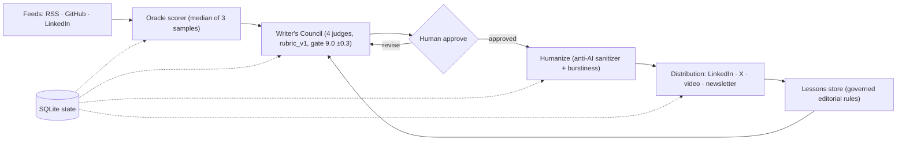

# Content Machine

Local-first, multi-model AI editorial engine that turns real engineering signals and lived experience into high-signal technical content.

[](https://github.com/prasadrane/Content-Machine/actions/workflows/ci.yml)


[](https://content-machine-chi-lac.vercel.app)

## Live Demo

Live demo: **https://content-machine-chi-lac.vercel.app** (public demo runs on free-tier Gemini quota - limited usage; service may degrade or stop mid-flight.)

## Screenshots

Oracle feed archive with scored candidates:


Writer's Council peak-iteration banner:


Distribute history drawer:


Governed lessons store:


Comments history:


Screenshots show the seeded demo dataset (`content_machine/demo_seed.py`: public article metadata + synthetic scores, placeholder persona), not production data.

## Architecture

The guiding invariant: AI as extraction, synthesis, and editorial council anchored in authentic human experience — never an unconstrained text generator.



## Subsystems Map

```
Content-Machine/
├── content_machine/
│   ├── oracle/          # Subsystem 1: Signal Ingestion & N-sample Scorer (RSS, GitHub, LinkedIn)
│   ├── asr/             # Subsystem 2: Voice Intake & CPU-int8 faster-whisper Transcription
│   ├── interview/       # Subsystem 3: Deep Technical Interview & Thesis Synthesis
│   ├── council/         # Subsystem 4: Writer's Council Multi-Model Deliberation Loop
│   ├── humanize/        # Subsystem 5: Two-tier Anti-AI Transformer & Burstiness Guardrails
│   ├── commenting/      # Subsystem 6: Grounded LinkedIn Comment Generation & History
│   ├── distribution/    # Subsystem 7: Multi-Channel Cross-Distribution (X threads, Video scripts)
│   ├── lessons/         # Subsystem 8: Governed Editorial Rule Store & Diff Extractor
│   ├── imaging/         # Per-post image-prompt generation (fills visual master-prompt §28 template)
│   ├── profile/         # Subsystem 9: Author Persona, Domains & Negative Constraints
│   ├── router/          # LLM Model Gateway & Anthropic Protocol Messages Adapter
│   ├── storage/         # SQLite State, Audit Log, Migrations & Local Paths
│   └── api/             # FastAPI REST Server & Static SPA Serving
├── ui/                  # Modular React + Vite + Tailwind CSS Editorial Cockpit
└── tests/               # 100% Offline-Capable Test Suite (389 backend, 78 UI)
```

## Core Capabilities

- **The Oracle**: Multi-feed connector (RSS/Atom with ETag caching, GitHub PRs/issues, LinkedIn Voyager) with 3-sample median consensus scoring against technical relevance and novelty.
- **Author Voice Grounding**: Codified author persona (Prasad Rane) and hard invariants enforced across all generation:
  1. *Zero Company Attribution* (never cite previous employers).
  2. *No False Corporate Employment* (no "my company today" or "our team at work").
  3. *Job-Status Agnostic Senior Tone* (speaks with architectural authority).
  4. *Current Operational Reality* (hands-on AI systems builder).
  5. *Zero Generic Praise & Emojis* (straight into the technical crux).
- **Writer's Council**: 4-judge parallel review board running rubric-grounded evaluations against the frozen `council/rubric_v1.md`:
  - **Narrative Judge** (`qwen3.8-max`): Narrative arc, personal stake, hook velocity.
  - **Punch Judge** (`qwen3.8-flash`): Directness, punchiness, visual rhythm.
  - **Depth Judge** (`qwen3.8-max`): Substantive depth, empirical grounding, timelessness.
  - **Slop Allergist** (`qwen3.8-flash`): Lexical/syntactic purity, purging AI tells.
- **Humanize Transformer**: Two-tier guardrail system combining an LLM generative rewrite pass with a deterministic sanitizer:
  - Purges 41 canonical AI-tell variants (*delve, tapestry, pivotal, testament, cornerstone, robust, etc.*) and 26 multi-word puffery phrases.
  - Refined em-dash normalization that preserves CLI flags (`--flag`) and Markdown dividers (`---`).
  - Burstiness measurement: sentence-length standard deviation computed and reported per output as `burstiness_score`.
- **LinkedIn Commenting Tool**: Synthesizes 2–3 sentence senior comments from 3 strategic angles (`Insightful`, `Contrarian`, `Question`) with voice dictation and post-council polish.
- **Cross-Channel Distribution**: Transforms approved anchor posts into platform-native X/Twitter threads, spoken short-form video scripts (with `[Visual Cue]` and `[Camera Zoom]` markers), and newsletter digests.
- **Governed Lessons Store**: Human-approved negative constraint repository with diff analysis and vector deduplication.

## Engineering Highlights

- **N-Sample Median Consensus Scoring** ([content_machine/oracle/scorer.py](content_machine/oracle/scorer.py)). Single LLM-call scores are noisy, so a score is never trusted alone. `IdeaScorer` runs the scanner model concurrently N times (default 3, wired from `thresholds.idea_samples`) and takes `statistics.median` of the composite and of each dimension. The median drives a three-band verdict: pass at/above the gate, review inside the margin band, reject below it.
- **Frozen Rubric, Gated Council Loop** ([content_machine/council/](content_machine/council/)). The 4 judges score against [`council/rubric_v1.md`](council/rubric_v1.md), loaded read-only each deliberation — revising the rubric means a versioned commit, never a runtime mutation. [gate.py](content_machine/council/gate.py) holds the decision: raw composite ≥ 9.0, with a ±0.3 margin band triggering a resample, capped at 3 iterations. Per-judge z-normalization against `judge_score_history` ([normalize.py](content_machine/council/normalize.py)) only engages once every dimension has ≥ 30 samples; the gate default deliberately stays on the raw rule until calibration.
- **Two-Layer Model-Router Failover** ([content_machine/router/base.py](content_machine/router/base.py)). The adapters split failures into `ProviderError` (connection, timeout, retryable HTTP status) and `ModelError` (refusal, schema-invalid output after retries). The router consumes the distinction: a provider error advances to the next route for the same model; a model error abandons that model for the next one in the layer. A rolling `EndpointHealth` window also skips routes whose recent p50 latency exceeds `preferred_max_latency_s`.
- **Two-Tier Humanize with Deterministic Fallback** ([content_machine/humanize/](content_machine/humanize/)). The LLM rewrite tier can fail without failing the pipeline: [transformer.py](content_machine/humanize/transformer.py) catches router errors and runs the pure sanitizer on the original. The sanitizer ([sanitizer.py](content_machine/humanize/sanitizer.py)) purges 41 banned word variants and 26 puffery phrases, and its boundary-checked em-dash regex normalizes prose dashes to commas while leaving CLI flags (`--flag`) and Markdown dividers (`---`) intact. Sentence-length standard deviation is computed and reported per result as `burstiness_score`.
- **Doc-Drift Guard in CI** ([tests/test_doc_drift.py](tests/test_doc_drift.py)). Offline pytest checks bind README judge-model lines to `config.json`, the AGENTS.md rule cap to `lessons/store.py`, the 120–280 word-count rule to `editorial/rules.py`, and every council model to the AGENTS.md routable allowlist. A doc edit that diverges from config truth fails the build.
- **Public-Demo Isolation** ([content_machine/config.py](content_machine/config.py), [content_machine/demo_seed.py](content_machine/demo_seed.py), [content_machine/api/rate_limit.py](content_machine/api/rate_limit.py)). `DEMO_MODE=1` re-points all LLM roles at free-tier Gemini flash models, skips syncing the real author profile into the store, and seeds a synthetic "John Doe" showcase persona instead. In-memory middleware caps public `POST /api/*` traffic at 10 requests per IP per minute.

## Technology Stack

| Technology | Responsibility |
| --- | --- |
| Python 3.11+ · FastAPI · Uvicorn | Backend engine, REST API, static SPA serving |
| Pydantic v2 | Config models and structured-output schemas |
| `anthropic` SDK · `httpx` · `requests` | Relay Messages-protocol calls, Gemini REST, feed fetches |
| SQLite (stdlib `sqlite3`) | All persistent state — no external database service |
| faster-whisper (optional install) | CPU int8 transcription, run as a CLI subprocess |
| React 18 · Vite 6 · Tailwind CSS 3 | Editorial cockpit UI |
| Vitest · Testing Library · jsdom | UI test stack |
| GitHub Actions | CI: backend pytest job + UI vitest job |
| Vercel | Public demo hosting (SPA build + Python API function) |

## Quickstart

### Prerequisites
- Python 3.11+
- Node.js 22+
- Intel/AMD CPU or Apple Silicon (no GPU required; ASR runs CPU-int8)

### Installation

```bash
# 1. Clone repository
git clone https://github.com/prasadrane/Content-Machine.git
cd Content-Machine

# 2. Setup Python environment
python -m venv .venv
source .venv/bin/activate  # On Windows: .venv\Scripts\activate
pip install -r requirements.txt

# 3. Build UI
cd ui
npm install
npm run build
cd ..
```

### Configuration

Set your relay credentials in environment or `.env`:
```bash
export ANTHROPIC_BASE_URL="http://your-relay-host:port/apps/anthropic"
export ANTHROPIC_AUTH_TOKEN="your-bearer-token"
```

### Launch Server

```bash
python -m content_machine serve --port 8080
```

Open **`http://localhost:8080`** in your browser.

### Development mode

Run backend and frontend with hot reload:

```bash
# Terminal 1: backend
python -m uvicorn content_machine.api.app:app --port 8080

# Terminal 2: UI dev server
cd ui
npm run dev
```

Vite proxies `/api` to the backend (`BACKEND_PORT`, default `8080`); the dev server listens on `PORT` (default `5174`).

## CLI Usage

```bash
# Score ideas from developer RSS feeds
python -m content_machine oracle --rss https://dev.to/feed

# Run Writer's Council evaluation on a draft post
python -m content_machine council draft.md

# Generate a grounded LinkedIn comment
python -m content_machine comment --post "Kafka partition rebalance issues..." --angle insightful

# De-AI and humanize any draft text
python -m content_machine humanize draft.txt --channel linkedin_post --tone pragmatic_architect

# Extract editorial rules from draft vs published diff
python -m content_machine lessons diff draft_v1.md published.md

# Synthesize cross-channel derivative assets
python -m content_machine distribute post.md --slug my-post

# Generate per-post image prompts (§28) for the Windmill Idea Bank
python -m content_machine imageprompts "path/to/Prasad Windmill Idea Bank.xlsx" --rows 2-26
# Preview without writing: add --dry-run
```

## Quality Gates

- **Offline test suite**: 100% offline-capable, zero live network access or API calls — 389 backend tests, 78 UI tests. Scope and run details: [docs/testing.md](docs/testing.md).
  ```bash
  python -m pytest tests -q   # backend (also: python -m unittest discover -s tests)
  cd ui && npx vitest run     # frontend
  ```
- **CI**: GitHub Actions on `ubuntu-latest` — backend pytest job and UI vitest job on every push/PR (`.github/workflows/ci.yml`).
- **Doc-drift guard**: `tests/test_doc_drift.py` pins documentation claims to code and config truth (README judge-model lines vs `config.json`, active-rule cap vs `lessons/store.py`, the 120–280 word-count rule vs `editorial/rules.py`, routable models vs the AGENTS allowlist). Any doc/code divergence fails CI.
- **Frozen rubric**: `council/rubric_v1.md` is versioned and immutable at runtime; publish gate is raw consensus ≥ 9.0 (margin ±0.3) over at most 3 iterations.
- **Score normalization**: per-judge raw scores are z-normalized against historical distributions, gated at `n ≥ 30` samples (`normalization_min_samples`), so sparse history never distorts the gate.

## Documentation

- [ARCHITECTURE.md](ARCHITECTURE.md) — subsystem deep-dive, data flow, state model
- [docs/testing.md](docs/testing.md) — test scope, offline guarantees, how to run
- [docs/deployment.md](docs/deployment.md) — local and Vercel demo deployment
- [docs/adr/README.md](docs/adr/README.md) — candidate architecture decision records (awaiting owner confirmation)
- [SECURITY.md](SECURITY.md) — vulnerability reporting and implemented security mechanisms

## License

MIT — see [LICENSE](LICENSE).
