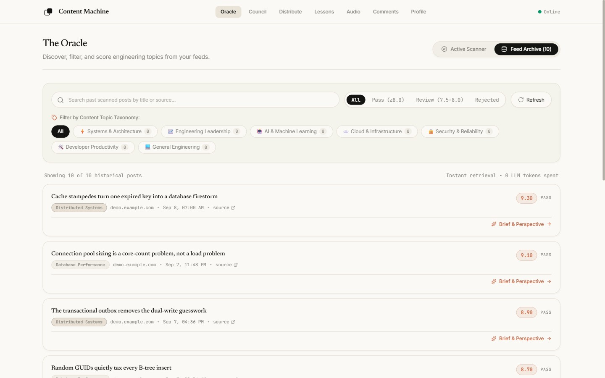
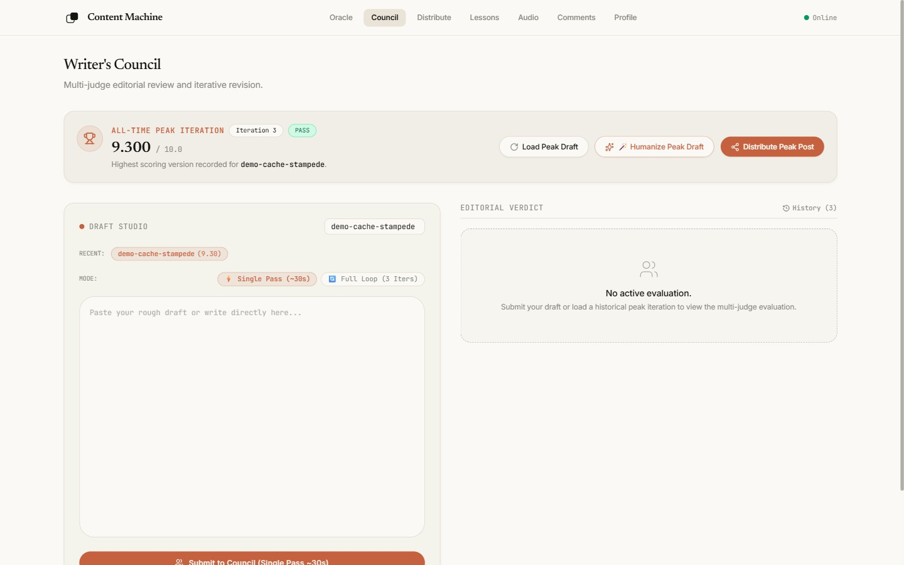
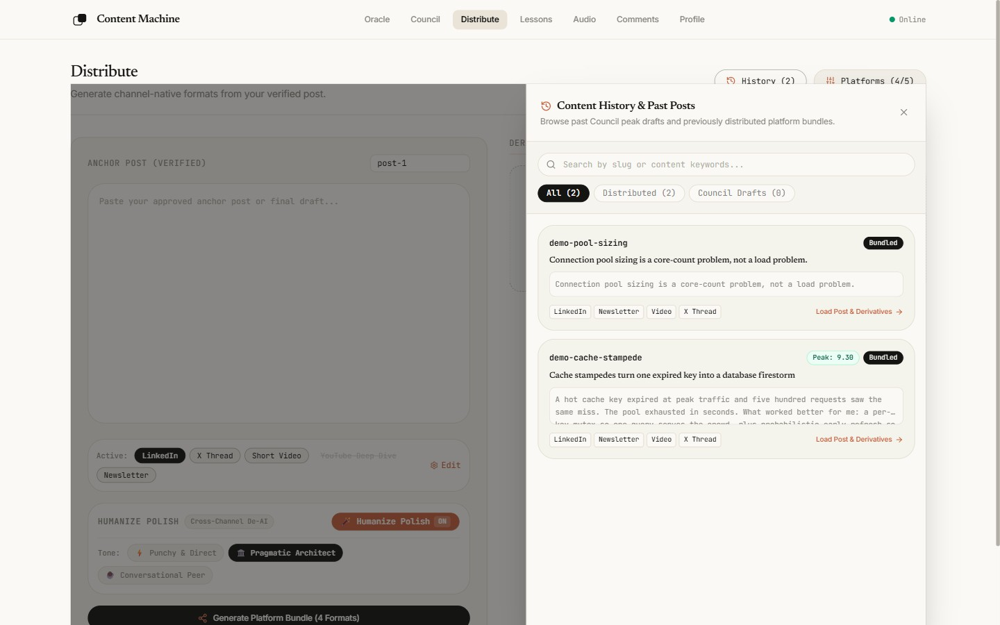
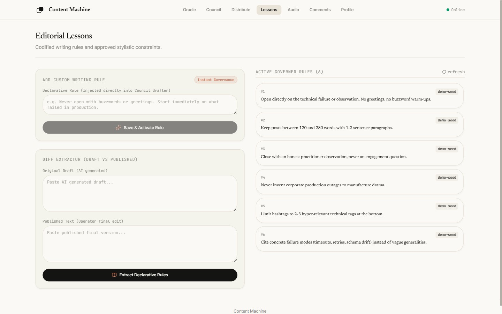
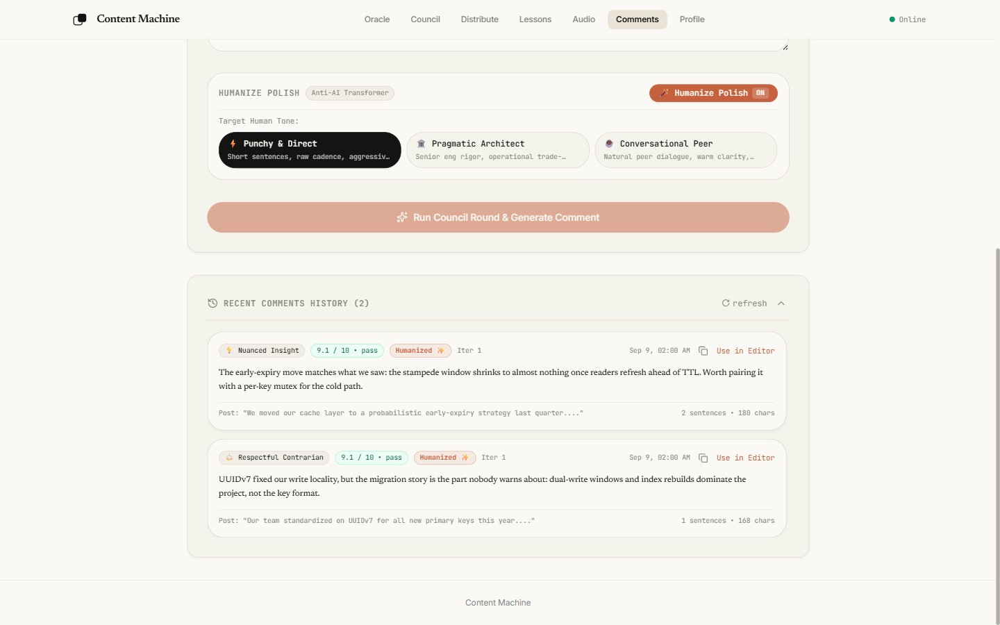
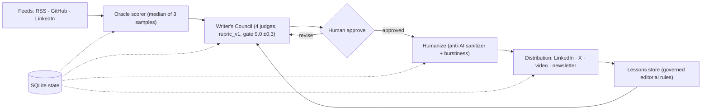

# Content Machine

Local-first, multi-model AI editorial engine that turns real engineering signals and lived experience into high-signal technical content.

[](https://github.com/prasadrane/Content-Machine/actions/workflows/ci.yml)


## Live Demo

Live demo: <!-- LIVE_DEMO_URL --> (public demo runs on free-tier Gemini quota - limited usage; service may degrade or stop mid-flight.)

## Screenshots

Oracle feed archive with scored candidates:



Writer's Council peak-iteration banner:



Distribute history drawer:



Governed lessons store:



Comments history:



Screenshots show the seeded synthetic demo dataset (`content_machine/demo_seed.py`), not production data.

## Architecture

The guiding invariant: AI as extraction, synthesis, and editorial council anchored in authentic human experience — never an unconstrained text generator.



## Subsystems Map

```
Content-Machine/
├── content_machine/
│   ├── oracle/          # Subsystem 1: Signal Ingestion & N-sample Scorer (RSS, GitHub, LinkedIn)
│   ├── asr/             # Subsystem 2: Voice Intake & CPU-int8 faster-whisper Transcription
│   ├── interview/       # Subsystem 3: Deep Technical Interview & Thesis Synthesis
│   ├── council/         # Subsystem 4: Writer's Council Multi-Model Deliberation Loop
│   ├── humanize/        # Subsystem 5: Two-tier Anti-AI Transformer & Burstiness Guardrails
│   ├── commenting/      # Subsystem 6: Grounded LinkedIn Comment Generation & History
│   ├── distribution/    # Subsystem 7: Multi-Channel Cross-Distribution (X threads, Video scripts)
│   ├── lessons/         # Subsystem 8: Governed Editorial Rule Store & Diff Extractor
│   ├── imaging/         # Per-post image-prompt generation (fills visual master-prompt §28 template)
│   ├── profile/         # Subsystem 9: Author Persona, Domains & Negative Constraints
│   ├── router/          # LLM Model Gateway & Anthropic Protocol Messages Adapter
│   ├── storage/         # SQLite State, Audit Log, Migrations & Local Paths
│   └── api/             # FastAPI REST Server & Static SPA Serving
├── ui/                  # Modular React + Vite + Tailwind CSS Editorial Cockpit
└── tests/               # 100% Offline-Capable Test Suite (360 backend, 75 UI)
```

## Core Capabilities

- **The Oracle**: Multi-feed connector (RSS/Atom with ETag caching, GitHub PRs/issues, LinkedIn Voyager) with 3-sample median consensus scoring against technical relevance and novelty.
- **Author Voice Grounding**: Codified author persona (Prasad Rane) and hard invariants enforced across all generation:
  1. *Zero Company Attribution* (never cite previous employers).
  2. *No False Corporate Employment* (no "my company today" or "our team at work").
  3. *Job-Status Agnostic Senior Tone* (speaks with architectural authority).
  4. *Current Operational Reality* (hands-on AI systems builder).
  5. *Zero Generic Praise & Emojis* (straight into the technical crux).
- **Writer's Council**: 4-judge parallel review board running rubric-grounded evaluations against the frozen `council/rubric_v1.md`:
  - **Narrative Judge** (`qwen3.8-max`): Narrative arc, personal stake, hook velocity.
  - **Punch Judge** (`qwen3.8-flash`): Directness, punchiness, visual rhythm.
  - **Depth Judge** (`qwen3.8-max`): Substantive depth, empirical grounding, timelessness.
  - **Slop Allergist** (`qwen3.8-flash`): Lexical/syntactic purity, purging AI tells.
- **Humanize Transformer**: Two-tier guardrail system combining an LLM generative rewrite pass with a deterministic sanitizer:
  - Purges 35+ canonical AI tells (*delve, tapestry, pivotal, testament, cornerstone, robust, etc.*) and multi-word puffery.
  - Refined em-dash normalization that preserves CLI flags (`--flag`) and Markdown dividers (`---`).
  - Statistical burstiness enforcement ($\sigma \ge 3.5$) across sentence word lengths.
- **LinkedIn Commenting Tool**: Synthesizes 2–3 sentence senior comments from 3 strategic angles (`Insightful`, `Contrarian`, `Question`) with voice dictation and post-council polish.
- **Cross-Channel Distribution**: Transforms approved anchor posts into platform-native X/Twitter threads, spoken short-form video scripts (with `[Visual Cue]` and `[Camera Zoom]` markers), and newsletter digests.
- **Governed Lessons Store**: Human-approved negative constraint repository with diff analysis and vector deduplication.

## Quickstart

### Prerequisites
- Python 3.11+
- Node.js 22+
- Intel/AMD CPU or Apple Silicon (no GPU required; ASR runs CPU-int8)

### Installation

```bash
# 1. Clone repository
git clone https://github.com/prasadrane/Content-Machine.git
cd Content-Machine

# 2. Setup Python environment
python -m venv .venv
source .venv/bin/activate  # On Windows: .venv\Scripts\activate
pip install -r requirements.txt

# 3. Build UI
cd ui
npm install
npm run build
cd ..
```

### Configuration

Set your relay credentials in environment or `.env`:
```bash
export ANTHROPIC_BASE_URL="http://your-relay-host:port/apps/anthropic"
export ANTHROPIC_AUTH_TOKEN="your-bearer-token"
```

### Launch Server

```bash
python -m content_machine serve --port 8080
```

Open **`http://localhost:8080`** in your browser.

### Development mode

Run backend and frontend with hot reload:

```bash
# Terminal 1: backend
python -m uvicorn content_machine.api.app:app --port 8080

# Terminal 2: UI dev server
cd ui
npm run dev
```

Vite proxies `/api` to the backend (`BACKEND_PORT`, default `8080`); the dev server listens on `PORT` (default `5174`).

## CLI Usage

```bash
# Score ideas from developer RSS feeds
python -m content_machine oracle --rss https://dev.to/feed

# Run Writer's Council evaluation on a draft post
python -m content_machine council draft.md

# Generate a grounded LinkedIn comment
python -m content_machine comment --post "Kafka partition rebalance issues..." --angle insightful

# De-AI and humanize any draft text
python -m content_machine humanize draft.txt --channel linkedin_post --tone pragmatic_architect

# Extract editorial rules from draft vs published diff
python -m content_machine lessons diff draft_v1.md published.md

# Synthesize cross-channel derivative assets
python -m content_machine distribute post.md --slug my-post

# Generate per-post image prompts (§28) for the Windmill Idea Bank
python -m content_machine imageprompts "path/to/Prasad Windmill Idea Bank.xlsx" --rows 2-26
# Preview without writing: add --dry-run
```

## Quality Gates

- **Offline test suite**: 100% offline-capable, zero live network access or API calls — 360 backend tests, 75 UI tests.
  ```bash
  python -m pytest tests -q   # backend (also: python -m unittest discover -s tests)
  cd ui && npx vitest run     # frontend
  ```
- **CI**: GitHub Actions on `ubuntu-latest` — backend pytest job and UI vitest job on every push/PR (`.github/workflows/ci.yml`).
- **Doc-drift guard**: `tests/test_doc_drift.py` pins documentation claims to code and config truth (README judge-model lines vs `config.json`, active-rule cap vs `lessons/store.py`, the 120–280 word-count rule vs `editorial/rules.py`, routable models vs the AGENTS allowlist). Any doc/code divergence fails CI.
- **Frozen rubric**: `council/rubric_v1.md` is versioned and immutable at runtime; publish gate is raw consensus ≥ 9.0 (margin ±0.3) over at most 3 iterations.
- **Score normalization**: per-judge raw scores are z-normalized against historical distributions, gated at `n ≥ 30` samples (`normalization_min_samples`), so sparse history never distorts the gate.

## License

MIT — see [LICENSE](LICENSE).
