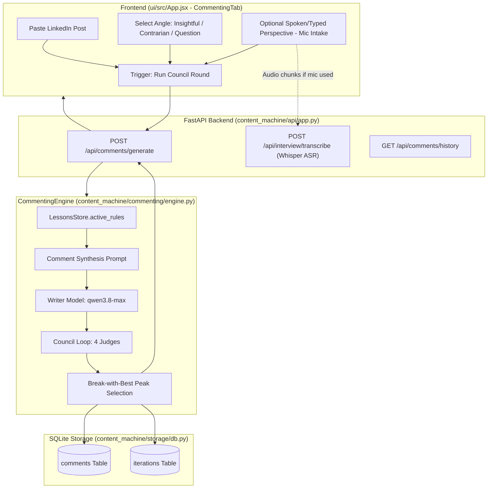

# Design Specification: LinkedIn Commenting Tool

**Date:** 2026-09-06  
**Status:** Approved  
**Author:** Pair Programming Agent & User  
**Subsystem:** Tools / Commenting Engine (`content_machine/commenting`)

---

## 1. Overview & Objective

The **Commenting Tool** adds a dedicated editorial module under the **Tools** section in Content Machine. It enables the user to paste any LinkedIn post and generate a high-signal, punchy 2–3 sentence comment. 

The comment generation process enforces two core Content Machine pillars:
1. **Governed Editorial Rules & Anti-Slop**: Injects active rules from `LessonsStore` (`03_content-lessons.md`) to ban superficial corporate clichés, empty cheerleading (e.g., *"Spot on!", "Thanks for sharing"*), and emoji inflation.
2. **Writer's Council Evaluation**: Runs the synthesized draft through the full 4-Judge Writer's Council (`qwen3.8-max` Perell, `qwen3.8-flash` Puri, `qwen3.7-plus` Housel, `qwen3.6-flash` Slop Allergist) with z-score normalization and revision cycles, returning the peak-scoring comment along with transparent judge feedback.
3. **Optional Spoken Perspective Intake**: Allows the user to dictate their counterpoint or lived observation using browser speech-to-text / audio transcription, editing the transcribed text before generating.

---

## 2. Architecture & Data Flow



---

## 3. Detailed Specifications

### 3.1 Data Model & Persistence (`content_machine/storage/db.py`)
Add a new SQLite table `comments`:
```sql
CREATE TABLE IF NOT EXISTS comments (
    id TEXT PRIMARY KEY,
    post_content TEXT NOT NULL,
    angle TEXT NOT NULL,                -- 'insightful', 'contrarian', 'question'
    perspective_text TEXT,              -- Optional operator perspective
    initial_draft TEXT NOT NULL,        -- Initial synthesized comment
    final_comment TEXT NOT NULL,        -- Council-polished 2-3 sentence comment
    iteration_count INTEGER NOT NULL,   -- Number of council rounds completed
    peak_score REAL NOT NULL,           -- Highest composite score achieved
    verdict TEXT NOT NULL,              -- 'PASS' or 'BREAK'
    judge_critiques TEXT,               -- JSON serialized per-judge breakdown & scores
    created_at TEXT NOT NULL DEFAULT (datetime('now'))
);
```

### 3.2 Schemas (`content_machine/schemas.py`)
```python
from enum import Enum
from typing import Optional, Dict, List
from pydantic import BaseModel, Field

class CommentAngle(str, Enum):
    INSIGHTFUL = "insightful"      # Nuanced value-add / tactical observation
    CONTRARIAN = "contrarian"      # Respectful alternative view / edge-case
    QUESTION = "question"          # High-signal thought-provoking question

class GenerateCommentRequest(BaseModel):
    post_content: str = Field(min_length=10, description="Pasted LinkedIn post content")
    angle: CommentAngle = Field(default=CommentAngle.INSIGHTFUL)
    perspective_text: Optional[str] = Field(default=None, description="Optional spoken or typed perspective")

class CommentRunResponse(BaseModel):
    comment_id: str
    initial_draft: str
    final_comment: str
    iteration: int
    peak_score: float
    verdict: str
    actions: List[str]
    judge_scores: Dict[str, float]
    judge_critiques: Dict[str, str]

class CommentHistoryItem(BaseModel):
    id: str
    post_content: str
    angle: str
    perspective_text: Optional[str]
    final_comment: str
    iteration_count: int
    peak_score: float
    verdict: str
    created_at: str

class CommentHistoryResponse(BaseModel):
    items: List[CommentHistoryItem]
    total: int
```

### 3.3 Synthesis Prompt & Invariants (`content_machine/commenting/engine.py`)
The comment synthesizer:
1. **Anchor**: Strict grounding in the operator's spoken perspective if provided. If not provided, derives a sharp observation from the post itself.
2. **Angle Directives**:
   - `insightful`: Extends the author's argument with a concrete real-world observation, metric, or tactical tradeoff.
   - `contrarian`: Respectfully challenges an unstated premise or introduces a critical counter-intuitive edge case.
   - `question`: Synthesizes the core tension and poses a senior-level question that advances the conversation.
3. **Hard Negative Constraints**:
   - Zero empty praise ("Great post!", "100% agree", "Thanks for sharing", "Love this").
   - Zero rhetorical filler ("In today's fast-paced world...", "It is important to remember...").
   - Active governed rules fetched from `LessonsStore.active_rules()`.
4. **Length Enforcement**: Exactly 2 to 3 sentences. No bullet points, no headers, no hashtags.

### 3.4 Council Integration
- Utilizes `run_council` with `spike_id=f"comment_{uuid4().hex[:8]}"`.
- The 4 judges (Perell, Puri, Housel, Slop Allergist) critique the draft against the rubric.
- If revision is required, the feedback loop prompts the writer model while preserving the 2–3 sentence constraint.
- The iteration with the highest composite score is selected as `final_comment`.

### 3.5 User Interface (`ui/src/App.jsx`)
1. **Tools Navigation**:
   - Add `Commenting` tab button alongside `Lessons` and `Audio` in the auxiliary tools section.
2. **Input Section**:
   - Target LinkedIn Post textarea (auto-resizing, paste-ready).
   - Angle selector pill buttons (`💡 Nuanced Insight`, `⚖️ Respectful Contrarian`, `❓ High-Signal Question`).
   - Perspective textarea with integrated `🎙️ Speak Perspective` microphone button.
   - Web Speech API + MediaRecorder fallback for instant voice transcription into the perspective textarea.
3. **Editorial Polish Card**:
   - Prominent serif/sans typography displaying the 2–3 sentence polished comment.
   - Sentence count & character count badges.
   - One-click copy with copied feedback animation.
   - Expandable Council Deliberation accordion with individual judge scores, verdicts, and suggestions.
4. **History Drawer**:
   - List of previously generated comments for quick retrieval and re-use.

---

## 4. Error Handling & Edge Cases

1. **Short / Empty Input**: Reject submissions with fewer than 10 characters with a clear user alert.
2. **Overly Long LLM Output**: The backend sanitizes output to at most 3 sentences if the model exceeds the constraint.
3. **Microphone Permission Denied**: Web Speech falls back gracefully to file upload or informs user of browser permissions.
4. **Offline / Relay Error**: Standard error notification banner with retry capability.

---

## 5. Testing & Verification Plan

In adherence to repository rules and TDD:
1. **Unit Tests (`tests/test_commenting.py`)**:
   - Test comment synthesis prompt generation with and without perspective text.
   - Test angle instructions mapping.
   - Test injection of active rules from `LessonsStore`.
   - Test comment persistence and history retrieval from SQLite.
   - Test mock router end-to-end execution of `CommentingEngine.generate_comment()`.
2. **API Tests (`tests/test_api.py`)**:
   - Test `POST /api/comments/generate` (success and validation error).
   - Test `GET /api/comments/history`.
3. **Frontend Verification**:
   - Verify tab navigation under Tools.
   - Verify angle switching and live mic input.
   - Verify comment rendering, copy button, and council accordion.
