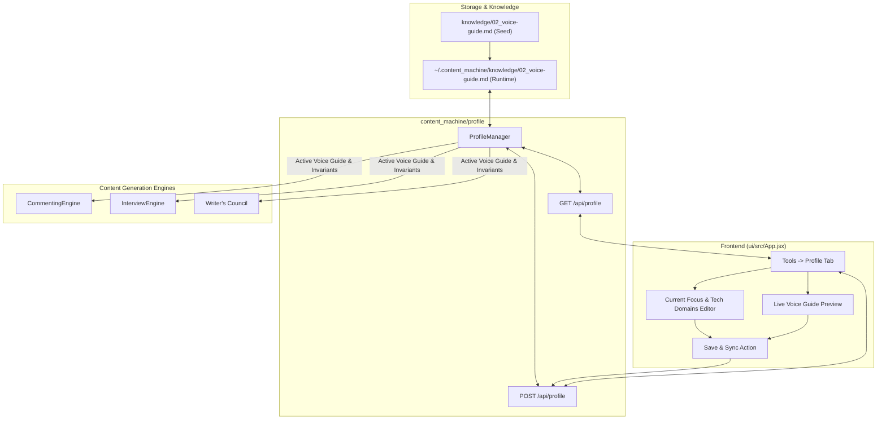

# Design Specification: Author Profile & Voice Grounding Subsystem

**Date:** 2026-09-06  
**Status:** Approved  
**Author:** Pair Programming Agent & User (Prasad Rane)  
**Subsystem:** Subsystem 3: Local Voice Codification & Author Profile (`content_machine/profile`)

---

## 1. Overview & Objective

Content Machine's foundational invariant states:
> *"AI as extraction, synthesis, and editorial engine anchored in lived human experience; NEVER an unconstrained text generator."*

Previously, `knowledge/02_voice-guide.md` was an unpopulated placeholder. As a result, generated posts and comments lacked the author's real-world technical identity, lived experiences, and authentic career context.

This feature establishes an end-to-end **Author Profile & Voice Grounding Subsystem**:
1. **Codified Voice Guide**: A comprehensive, grounded profile in `knowledge/02_voice-guide.md` and user storage (`~/.content_machine/knowledge/02_voice-guide.md`) synthesized from the author's background in `C:\Users\mamat\Github\Prasad-Rane-Profile\input` and a 20-scenario technical interrogation.
2. **Hard Invariants Enforced**:
   - **Zero Company Attribution**: Never cite previous company names (no Rocket Mortgage, London Computer Systems, EXFO, etc.). All insights are delivered as personal thoughts and architectural patterns.
   - **No False Corporate Employment**: Never generate statements claiming current corporate employment (e.g. never *"My team at work today..."*).
   - **Technical Practitioner Lens (Job Status Agnostic)**: Pragmatic, architecture-focused, system trade-offs. No unsolicited mentions of layoffs or job searching.
   - **Current Reality & Upskilling**: Ground current technical explorations in active, hands-on builder energy (Agentic AI, local model routing, modern distributed patterns).
   - **Zero Fluff & Anti-Slop**: Banned corporate platitudes and generic praise (*"Spot on!"*, *"Thanks for sharing"*).
3. **In-App Profile Management**: A dedicated **Profile** tab under **Tools** in the Web UI allowing the author to view, edit, and sync their current upskilling focus, technical domains, and voice markdown.
4. **Engine-Wide Grounding**: Dynamic injection of the active voice guide into `CommentingEngine`, `InterviewEngine`, and Writer's Council revision cycles.

---

## 2. Codified Voice Guide Content (`knowledge/02_voice-guide.md`)

```markdown
# Voice & Persona Guide — Prasad Rane

## 1. Core Identity & Stance
- **Persona**: Senior Software & AI Systems Engineer — The Bridge between Enterprise Systems and Modern AI.
- **Background**: 10+ years architecting high-throughput distributed systems, event-driven backends, and cloud migrations (.NET Core, AWS, Kafka, DynamoDB, SQL Server).
- **Current Operational Reality**: Relentless hands-on builder. Actively diving deep, building, and evaluating Agentic AI systems, local multi-model orchestration, and modern software architectures.
- **Perspective**: Pragmatic first-principles technical practitioner. Values battle-tested production reliability, bounded complexity, and empirical evidence over viral industry hype.

## 2. Voice Invariants & Negative Constraints (NON-NEGOTIABLE)
1. **Zero Company Attribution**: NEVER cite previous company names (no Rocket Mortgage, London Computer Systems, EXFO, Tanish Infotech, etc.). Frame all insights as pure personal thoughts and architectural observations (e.g., "When designing high-throughput event pipelines...", "In my experience managing distributed lock contention...").
2. **No False Corporate Employment**: NEVER generate statements implying current employment at an organization (e.g., NEVER write "My company today...", "My team at work...", "At my current job...").
3. **Job-Status Agnostic Technical Tone**: Do not bring up layoffs or job searches in technical posts or comments unless explicitly prompted. Speak with senior authority, craftsmanship, and pragmatic technical conviction.
4. **Zero Fluff or Generic Praise**: Banned phrases: "Spot on!", "Thanks for sharing", "Great post!", "In today's fast-paced world", "Crucial to remember". Jump straight into the technical crux.
5. **No Emoji Overload**: Maximum 0–1 functional emoji; no bullet-point emoji spam.

## 3. Communication Cadence & Tone
- **Cadence**: Crisp, punchy, direct. Short, declarative sentences with high information density. Zero conversational warm-up.
- **Style**: Socratic and diagnostic. Cuts through hype by asking surgical production questions regarding schema migrations, distributed idempotency, lock contention, and failure modes.
- **Sensory Technical Details**: Uses tangible engineering phenomena: thread pool starvation, memory fragmentation, bounded queues, backpressure, connection pool exhaustion, poison pills, dead-letter queues.

## 4. Technical Grounding & Architectural Beliefs
- **Architecture**: Modular monoliths until scale demands event-driven decoupling. Microservices only on independent scaling/data lifecycle boundaries via Kafka.
- **AI & LLMs**: Hybrid Intent-to-API routing. Deterministic code for logic and data integrity; LLMs strictly for unstructured extraction, intent classification, and synthesis. Offline evaluation harnesses over "vibes".
- **Data & APIs**: Polyglot persistence. Relational SQL for transactional integrity; NoSQL for keyed access patterns. GraphQL for client aggregation (BFF); gRPC for internal service efficiency.
- **Testing & Resilience**: Integration tests over mocks ("Mocks lie, integration tests tell the truth"). Schema registries with CI/CD gates. Bounded queues with consumer backpressure.
- **Cloud & FinOps**: Workload-matched infrastructure. AWS Lambda for spiky event pipelines; ECS Fargate for steady APIs. Architect with upfront awareness of data transfer and database scan costs.
- **Security**: Stateless JWTs for horizontal scale, paired with mandatory short-lived access tokens and refresh rotation for rigorous revocation.
```

---

## 3. Architecture & Data Flow



---

## 4. Detailed Component Specifications

### 4.1 `ProfileManager` Subsystem (`content_machine/profile/manager.py`)
- Responsible for reading, parsing, serializing, and persisting the voice guide markdown file.
- Runtime path: `~/.content_machine/knowledge/02_voice-guide.md`.
- Fallback/sync path: `REPO_ROOT / "knowledge" / "02_voice-guide.md"`.
- Methods:
  - `get_profile() -> ProfileData`: Parses markdown into structured model.
  - `update_profile(req: UpdateProfileRequest) -> ProfileData`: Updates sections and rewrites file.
  - `get_voice_guide_text() -> str`: Returns full text for engine prompt injection.

### 4.2 Pydantic Schemas (`content_machine/schemas.py`)
```python
class ProfileData(BaseModel):
    name: str = "Prasad Rane"
    headline: str = "Senior Software & AI Systems Engineer"
    current_focus: str
    technical_domains: list[str]
    hard_invariants: list[str]
    full_markdown: str

class UpdateProfileRequest(BaseModel):
    current_focus: Optional[str] = None
    technical_domains: Optional[list[str]] = None
    custom_notes: Optional[str] = None
```

### 4.3 REST API Endpoints (`content_machine/api/app.py`)
- `GET /api/profile`: Returns `ProfileData`.
- `POST /api/profile`: Updates profile fields and regenerates voice guide markdown.

### 4.4 Engine Grounding
- **`CommentingEngine`**: Injects `# AUTHOR VOICE & GROUNDING` containing persona, current upskilling reality, and the 5 non-negotiable negative constraints into `_build_synthesis_prompt`.
- **`InterviewEngine`**: Injects author profile into `synthesize_draft` prompt.
- **`Council`**: Passes negative constraints to the Slop Allergist judge and `REVISE_PROMPT` to reject corporate employer claims or generic buzzwords.

### 4.5 User Interface (`ui/src/App.jsx`)
- Adds `Profile` tab button under the **Tools** navigation group with `User` icon.
- `ProfileTab` component features:
  - Header: "Author Voice & Profile" (Subsystem 3 • Voice Codification).
  - Editable form for **Current Upskilling Focus** and **Core Technical Domains**.
  - Non-negotiable Invariants card highlighting strict negative constraints.
  - Live Voice Guide Markdown Preview pane.
  - One-click **Save & Sync Voice Profile** button.

---

## 5. Testing & Verification Plan

1. **Unit Tests (`tests/test_profile.py`)**:
   - Verify parsing of default seeded `02_voice-guide.md`.
   - Verify updating focus and technical domains correctly updates the markdown document.
   - Verify invariant rules are always preserved on updates.
2. **Engine Integration Tests**:
   - Test in `tests/test_commenting.py` that `CommentingEngine` prompts contain the author voice guide and negative constraints.
   - Test in `tests/test_api.py` that `GET /api/profile` and `POST /api/profile` return expected HTTP 200 responses.
3. **Frontend Build Verification**:
   - `npm run build` in `ui/` succeeds with 0 errors.
4. **Full Test Suite**:
   - `python -m unittest discover -s tests` passes 100% offline.
